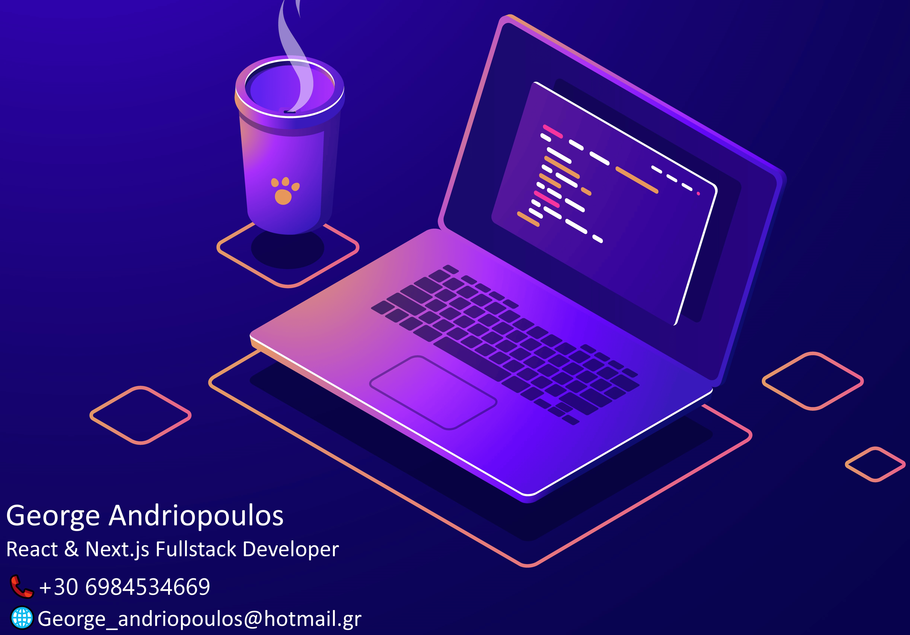

# Hi, I'm George Andriopoulos 👋

📍 Zakynthos, Greece  
💻 Frontend / Full Stack Engineer  
🚀 Building production-grade web & mobile applications

📫 Reach out:  
[Email](mailto:george_andriopoulos@hotmail.gr) ·
[LinkedIn](https://linkedin.com/in/george-andriopoulos-3107372b0) ·
[Portfolio](https://www.george-andriopoulos.com)

---

## 👨‍💻 About Me

I'm a **Frontend / Full Stack Engineer** focused on building **real-world, production-grade applications** used by real users.

I specialize in **React, React Native, Next.js, and TypeScript**, working across complex domains like **AI-driven products, healthcare, and SaaS platforms**. I regularly make architectural decisions, performance tradeoffs, and product-level improvements — not just UI work.

I care deeply about **code quality, scalability, performance, and user experience**, and I enjoy owning features end-to-end.

Outside of code, you'll find me lifting heavy weights 🏋️‍♂️ or refining side projects.

---

## 🌟 What I'm Up To

- 🔭 Building scalable web & mobile apps with React and Next.js  
- 🌱 Learning deeper backend & system design patterns  
- 👯 Open to impactful product-focused roles  
- 💬 Ask me about frontend architecture, performance, or UI systems  

---

## 🛠️ Tech Stack

---

## 📈 GitHub Stats

  
  

---

## 📊 Contribution Activity

  

---

## 🌍 Let's Connect

[LinkedIn](https://linkedin.com/in/george-andriopoulos-3107372b0) · [Portfolio](https://www.george-andriopoulos.com)
